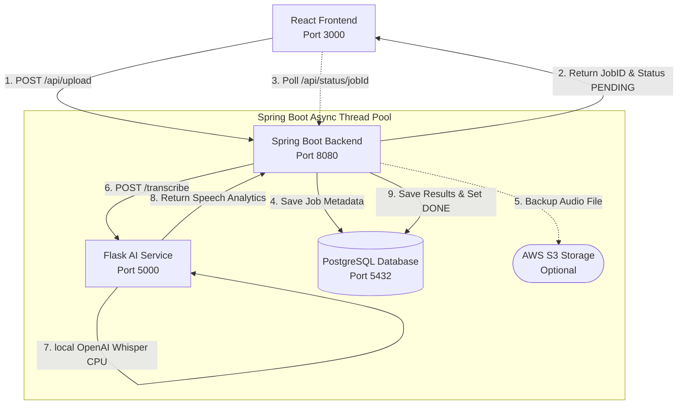

# 🎙️ Smart Interview Analyzer

An AI-powered full-stack mock interview feedback platform. It records/uploads interview audios, transcribes them locally using OpenAI Whisper on CPU, detects filler words, tracks speech pace (WPM), analyzes silence gaps, and displays communication metrics in a premium glassmorphic dashboard.

---

## ✨ Features

* **🛡️ JWT Authentication:** Secure login and registration powered by Spring Security.
* **🔬 Asynchronous AI Processing:** Non-blocking speech analysis using Spring @Async with dedicated ExecutorService thread pools — returns jobId immediately, processes transcription asynchronously.
* **🧠 Local OpenAI Whisper Integration:** Flask AI microservice running Whisper "base" model entirely on CPU.
* **📈 Rich Speech Telemetry:**
  * Accurate speech-to-text transcriptions.
  * Real-time filler word counts & details (`"um"`, `"uh"`, `"like"`, etc.).
  * Speech pace assessment (Words Per Minute).
  * Pause analysis (detecting awkward gaps > 0.5s).
* **📊 Premium Analytics Dashboard:** High-end dark cosmic UI using React and Recharts Area charts showing historical progress.
* **🐳 Single-Command Orchestration:** Docker Compose setup linking PostgreSQL 15, Spring Boot backend, and Flask AI.

---

## 🏗️ Architectural Design

The application uses an asynchronous, decoupled microservices architecture to process intensive audio transcriptions without locking client threads.

### System Architecture Flow:


### Data Flow Execution:
1. **Initiation:** The authenticated user uploads an audio recording on the **React Frontend**.
2. **Handshake:** The **Spring Boot Backend** generates a unique Job UUID, saves it to PostgreSQL as `PENDING`, spawns an asynchronous execution thread, and immediately returns the Job ID to React to prevent HTTP timeout.
3. **Polling:** The client starts polling the status endpoint every 2 seconds.
4. **Execution:** Inside the `@Async` thread pool, Spring Boot backups the file to S3 (if keys are configured) and transfers the file to the **Flask AI Service**.
5. **Whisper Telemetry:** Flask processes the audio through PyTorch CPU-optimized Whisper model, parses words, computes filler rates, assesses average pauses, and responds with a telemetry payload.
6. **Persistence:** Spring Boot parses the results, stores them in PostgreSQL `analysis_results` (with JSONB mappings for filler breakdown), and flags the Job status as `DONE`.
7. **Resolution:** The next poll from the client detects the `DONE` status, retrieves the completed data, and renders the telemetry details and performance charts.

---

## 🛠️ Tech Stack

* **Frontend:** React.js, Recharts, React Icons, CSS Glassmorphism
* **Backend:** Spring Boot 4.0.6 (Java 17), Spring Data JPA, Spring Security, JWT, Flyway
* **AI Service:** Flask, OpenAI Whisper (python-whisper), PyTorch (CPU-optimized)
* **Database:** PostgreSQL 15
* **Orchestration:** Docker, Docker Compose

---

## 🚀 Quick Start

Ensure you have **Docker Desktop** installed and running on your machine.

### Step 1: Run Back-End Services & Database
Clone this repository, navigate to the root directory, and spin up the database, Flask AI service, and Spring Boot backend:
```bash
docker-compose up --build -d
```
* The backend will automatically run database schema migrations via Flyway.
* Services will listen on:
  * Spring Boot API: `http://localhost:8080`
  * Flask AI Service: `http://localhost:5000`
  * PostgreSQL: `localhost:5432`

### Step 2: Run React Frontend
Navigate to the frontend folder, install dependencies, and start the development server:
```bash
cd frontend
npm install --legacy-peer-deps
npm start
```
Open **`http://localhost:3000`** in your browser to view the application live.

---

## ⚙️ Configuration File (`.env`)
Create a `.env` file in the root directory to configure custom credentials (an example is provided in `.env.sample`). If left empty, the pipeline will fallback to local temporary folders.
```env
DB_NAME=interview_analyzer
DB_USERNAME=postgres
DB_PASSWORD=changeme
JWT_SECRET=your_super_secret_key_at_least_256_bits_long
AWS_ACCESS_KEY=
AWS_SECRET_KEY=
AWS_REGION=ap-south-1
AWS_BUCKET_NAME=smart-interview-analyzer-audio-2026
```
